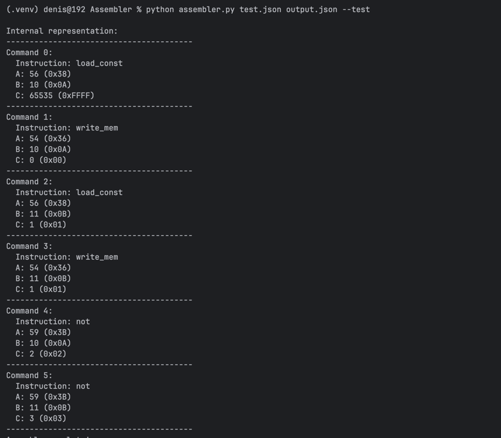
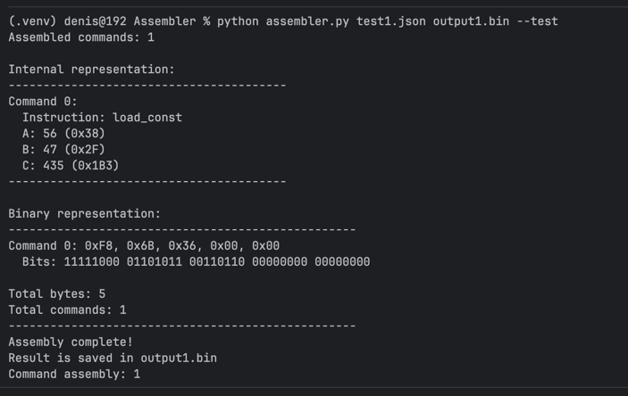
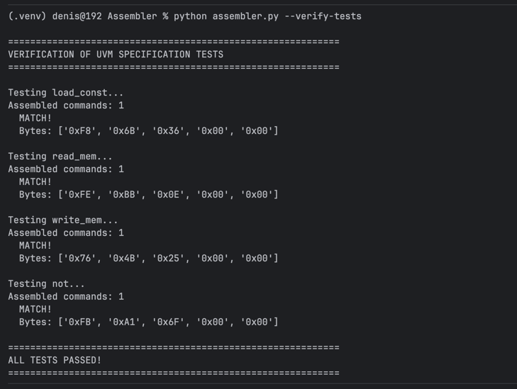
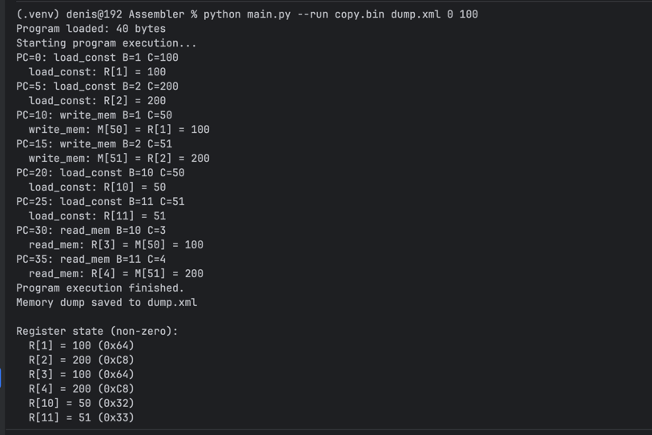
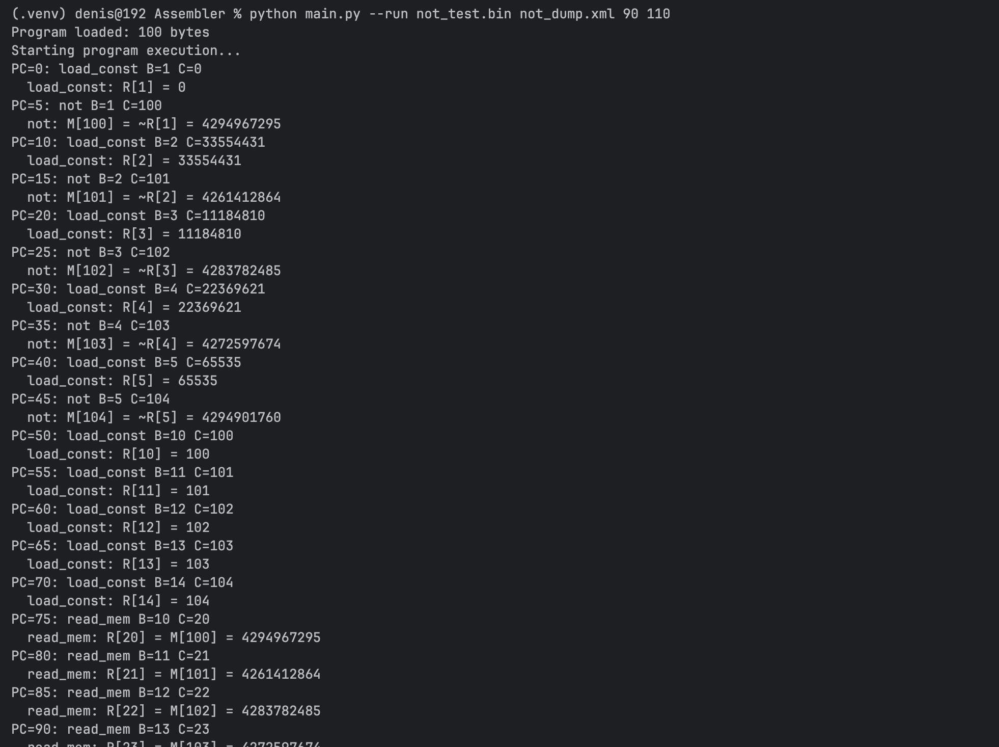
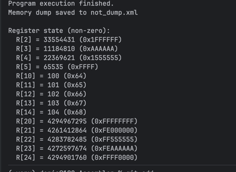

# Ассемблер для Учебной Виртуальной Машины (УВМ) - Этап 1

## Постановка задачи этапа 1

Создать CLI-приложение ассемблера, которое:

- Разбирает текстовое представление команд
- Транслирует в промежуточное представление (поля A, B, C)
- Выводит результат в формате полей и значений (в режиме тестирования)
- Проверяет соответствие тестовым данным из спецификации УВМ

## Первая программа

Создайте файл hello.json:

`[
  {"opcode": "load_const", "dest_reg": 1, "value": 42}
]`

Запустите ассемблирование:

`python assembler.py hello.json output.json --test`

## Язык ассемблера (JSON-формат)

Программа представляет собой JSON-массив команд. Каждая команда - JSON-объект.

### Поддерживаемые команды

1. #### *Загрузка константы (load_const)*

Загружает константу в указанный регистр.

`{
  "opcode": "load_const",
  "dest_reg": <номер регистра (0-127)>,
  "value": <константа (0-33554431)>
}`

Пример:

`{"opcode": "load_const", "dest_reg": 47, "value": 435}
→ Поля: A=56, B=47, C=435`

2. #### *Чтение из памяти (read_mem)*

Читает значение из памяти по адресу, хранящемуся в регистре-источнике, и записывает в регистр-приемник.

`{
  "opcode": "read_mem",
  "src_reg": <регистр-источник (0-127)>,
  "dest_reg": <регистр-приемник (0-127)>
}`

Пример:

`{"opcode": "read_mem", "src_reg": 111, "dest_reg": 117}
→ Поля: A=62, B=111, C=117`

3. #### *Запись в память (write_mem)*

Записывает значение из регистра в память по указанному адресу.

`{
  "opcode": "write_mem",
  "src_reg": <регистр-источник (0-127)>,
  "dest_addr": <адрес в памяти (0-8191)>
}`

Пример:

`{"opcode": "write_mem", "src_reg": 45, "dest_addr": 298}
→ Поля: A=54, B=45, C=298`

4. #### *Побитовое НЕ (not)*

Выполняет побитовую операцию НЕ над значением в регистре и записывает результат в память.

`{
  "opcode": "not",
  "src_reg": <регистр-источник (0-127)>,
  "dest_addr": <адрес в памяти (0-8191)>
}`

Пример:

`{"opcode": "not", "src_reg": 7, "dest_addr": 893}
→ Поля: A=59, B=7, C=893`

## Использование ассемблера

### Базовые команды

```
# Ассемблирование программы
python assembler.py input.json output.json
```

```
# Ассемблирование с выводом промежуточного представления
python assembler.py input.json output.json --test
```

```
# Создание тестовых файлов из спецификации УВМ
python assembler.py --create-tests
```

```
# Запуск всех тестов
python test_all.py
```

### Аргументы командной строки
```
assembler.py <input_file> <output_file> [--test]
  
  input_file   - путь к JSON-файлу с программой
  output_file  - путь для сохранения промежуточного представления
  --test       - режим тестирования с выводом полей A, B, C
```

## Примеры программ

Пример 1: Простая программа

```
[
  {"opcode": "load_const", "dest_reg": 0, "value": 100},
  {"opcode": "write_mem", "src_reg": 0, "dest_addr": 500},
  {"opcode": "load_const", "dest_reg": 1, "value": 255},
  {"opcode": "not", "src_reg": 1, "dest_addr": 600}
]
```
Пример 2: Программа из спецификации

```
# Создать тестовые файлы из спецификации
python assembler.py --create-tests
```

## Тестирование

```
# Тест 1: Загрузка константы
python assembler.py test1.json output1.json --test

# Тест 2: Чтение из памяти
python assembler.py test2.json output2.json --test

# Тест 3: Запись в память
python assembler.py test3.json output3.json --test

# Тест 4: Побитовое НЕ
python assembler.py test4.json output4.json --test
```

Ожидаемый вывод для теста 1 (load_const):
```
Internal representation:
----------------------------------------
Command 0:
  Instruction: load_const
  A: 56 (0x38)
  B: 47 (0x2F)
  C: 435 (0x1B3)
----------------------------------------
Assembly complete!
Result is saved in output1.json
```

## Примеры ошибок:

```
// Ошибка: отсутствует opcode
{"dest_reg": 10, "value": 100}

// Ошибка: неизвестный opcode
{"opcode": "unknown", "dest_reg": 1, "value": 100}

// Ошибка: выход за диапазон регистра
{"opcode": "load_const", "dest_reg": 200, "value": 100}

// Ошибка: выход за диапазон значения
{"opcode": "load_const", "dest_reg": 1, "value": 100000000}
```

## Формат выходного файла

Ассемблер сохраняет промежуточное представление в JSON-формате:

output.json:
```
[
  {
    "opcode": "load_const",
    "A": 56,
    "B": 47,
    "C": 435
  },
  {
    "opcode": "write_mem",
    "A": 54,
    "B": 45,
    "C": 298
  }
]
```
## Режим тестирования

При запуске с флагом --test ассемблер выводит внутреннее представление каждой команды в формате:

```
Command N:
  Instruction: <opcode>
  A: <значение> (0x<hex>)
  B: <значение> (0x<hex>)
  C: <значение> (0x<hex>)
Assembly state
Error message (if it is)
```

Реализовано:

- Чтение JSON-программы
- Проверка синтаксиса и семантики
- Определение кодов операций (поле A)
- Формирование полей B и C
- Вывод промежуточного представления
- Сохранение результата в JSON
- Обработка ошибок с понятными сообщениями
- Тестирование на примерах из спецификации

Демонстрация работы

Создание своей программы

```
[
  {"opcode": "load_const", "dest_reg": 10, "value": 65535},
  {"opcode": "write_mem", "src_reg": 10, "dest_addr": 0},
  {"opcode": "load_const", "dest_reg": 11, "value": 1},
  {"opcode": "write_mem", "src_reg": 11, "dest_addr": 1},
  {"opcode": "not", "src_reg": 10, "dest_addr": 2},
  {"opcode": "not", "src_reg": 11, "dest_addr": 3}
]
```
Запуск ассемблирования

`python assembler.py myprogram.json myprogram_out.json --test`

Вывод:



## Постановка задачи этапа 2

Доработать приложение, добавить:
- Транслятор из промежуточного в машинное представление
- Запись результата ассемблирования в двоичный выходной файл
- Вывод на экран числа ассемблированных команд
- В режиме тестирования вывод результата ассемблирования на экран в
байтовом формате, как в тесте из спецификации УВМ. 
- Создание файла на языке ассемблера, результат трансляции которого
соответствует всем тестовым байтовым последовательностям из
спецификации УВМ

Были добавлены методы `_generate_binary`, `_write_binary_file`, `_print_binary_representation`

Логика работы программы осталась прежней, но теперь результат сохраняется не в .json, а в .bin формате

## Вывод в тестовом режиме



## Файлы ассемблера

Файлы ассемблера, соответствующие спецификации, остались из этапа 1
Корректность трансляции проводится при выполнении команды

`python assembler.py --verify-tests`

Вывод тестов:



## Постановка задачи этапа 3

- создать цикл интерпретации
- реализовать модель памяти УВМ
- выполнить базовые команды

Добавлен интерпретатор, обрабатывающий бинарный файл из этапа 2

## Пример работы

`python main.py --run copy.bin dump.xml 0 100`

Вывод



## Постановка задачи этапа 4

- Добавить выполнение операции побитового НЕ
- Написать тест-программу

Команда НЕ была реализована ранее, были добавлены тесты для проверки корректности ее работоспособности

`python main.py --create-not-test`
`python main.py not_test.json not_test.bin`
`python main.py --run not_test.bin not_dump.xml 90 110`

Вывод





